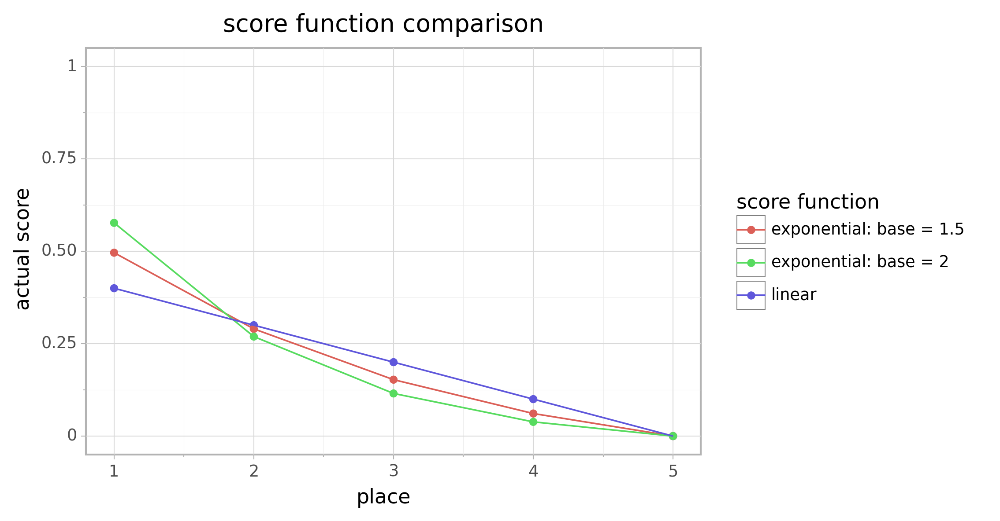

# multielo

This package implements a multiplayer extension of the popular Elo rating
system.

 * [Installation](#installation)
 * [Example Usage](#example-usage)
 * [Methodology](#methodology)
   * [Traditional Elo ratings](#traditional-elo-ratings)
   * [Extension to multiplayer](#extension-to-multiplayer)

## Installation

The package can be installed from GitHub with using ``pip install``::

```bash
pip install git+git://github.com/djcunningham0/multielo.git
```

## Example Usage

The following example shows how to calculate updated Elo ratings after a 
matchup using the default settings in the package.

```python
>>> from multielo import MultiElo
>>> import numpy as np
>>>
>>> elo = MultiElo()
>>>
>>> # player with 1200 rating beats a player with 1000 rating
>>> elo.get_new_ratings(np.array([1200, 1000]))
array([1207.68809835,  992.31190165])
>>>
>>> # player with 900 rating beats player with 1000 rating
>>> elo.get_new_ratings(np.array([900, 1000]))
array([920.48207999, 979.51792001])
>>>
>>> # 3-way matchup
>>> elo.get_new_ratings(np.array([1200, 900, 1000]))
array([1208.34629612,  910.43382278,  981.21988111])
```

See [`demo.ipynb`](https://github.com/djcunningham0/multielo/blob/master/demo.ipynb) 
for a more in-depth tutorial, including details on parameters that can be tuned
in the Elo algorithm and examples of how to use the Tracker and Player objects 
to keep track of Elo ratings for a group of players over time.

## Methodology

*Note: This multiplayer extension isn't very mathematically or statistically
rigorous. It seems to work reasonably well, but I don't think the rating values
are as interpretable as traditional Elo. Send me a note or open an issue if you
have ideas for improving the methodology.*

### Traditional Elo ratings

Traditional Elo ratings only apply to 1-on-1 matchups. The new ratings for the
players involved in a matchup are calculated from:
1. The initial ratings before the matchup.
2. The matchup result.

There are also a few parameters that must be set for an Elo rating system:
1. *K* controls how many Elo rating points are gained or lost in a single game.
Larger *K* results in larger changes after each matchup. A commonly used value
is *K* = 32.
2. *D* controls the estimated win probability of each player. A commonly used 
value is *D* = 400, which means that a player with a 200-point Elo advantage is
expected to win ~75% of the time. A smaller *D* value means the player with the
higher Elo rating has a higher estimated win probability.

Suppose we have two players, *A* and *B*, with initial ratings *R<sub>A</sub>* 
and *R<sub>B</sub>*, respectively. We calculate an "expected score" for each 
player according to those ratings. The expected score for player *A* is:


and the expected score for player *B* is defined similarly. 

To calculate the players' new ratings, we compare these expected scores with 
the "actual scores", or the matchup result. The actual score for player *A* is:


Then the new rating for player *A*, *R'<sub>A</sub>*, is calculated from the
initial rating, expected score, and actual score:


### Extension to multiplayer

At minimum, a reasonable extension of Elo to multiplayer matchups should have 
the following properties:
1. Changes in ratings should be zero sum, just like traditional Elo.
2. Coming in first place is better (improves your rating more) than coming in
second place, is better than third place, and so on. Losing (coming in last 
place) cannot improve your rating.
3. It should converge to traditional Elo when there are only two players in the
matchup.

**Expected scores**

The first issue we must address is that the Elo expected score calculation only
involves the ratings of two players. In order to generalize this calculation to
multiplayer matchups, we can treat a single multiplayer matchup as a 
combination set of all pairwise 1-on-1 matchups between every player involved. 
Specifically, in a multiplayer matchup with *N* players there would be


pairwise 1-on-1 matchups between the players.

To calculate each player's expected score for the multiplayer matchup, first we
calculate that player's expected score for each individual matchup just as with
traditional Elo. Then we scale the scores by *N(N-1)/2* so that the expected 
scores for all players sum to 1 (the expected scores are meant to represent 
probabilities so they must sum to 1).

The full expression for the expected score for player *A* in a multiplayer 
matchup with *N* players is:


**Actual scores**

The "actual scores" in traditional are binary: 1 point for a win, 0 for a loss.
In a multiplayer matchup there are more than two options, so we need a 
different definition for actual scores. We can introduce the idea of a "score
function", where the actual score for player *A* is given by:


This scoring function should have a few properties:
1. The scores must sum to 1 to match the expected scores.
2. The scores should be monotonically decreasing. That is, 1st place should 
have a higher score than 2nd, which has a higher score than 3rd, and so on.
3. Last place should have a score of 0 because a last-place finish should
never improve a player's rating.

Note that when there are only two players, the only score function that
satisfies all three conditions is the binary definition.

With more than two players, there are many possible score functions that
satisfy all three conditions. Perhaps the most natural score function is what 
is defined in this implementation as a *linear score function*:


where *N* is the number of players and *p<sub>A</sub>* is the place that player
*A* finishes in (1 for first place, 2 for second, and so on). For example, with
five players, the actual scores awarded to the players in order of finish are 
[0.4, 0.3, 0.2, 0.1, 0]. When using the linear score function, each improvement
in place is weighted equally. That is, improving from second to first has the 
same impact to the player's actual score as improving from third to second, and
so on.

In some cases it may be of interest to give more value to the top finishers. 
For example, in a poker game where only the top three finishers are paid out,
it may be optimal for players to take risks that improve their chances of
coming in first place rather than minimizing their chance of finishing in last.
That is, players will try to finish at the top, but there is very little 
real-world difference in finishing in last rather than second-to-last. One
solution to these cases is to use what is defined in this implementation as an
*exponential score function*:


where *N* is the number of players, *p<sub>A</sub>* is the place that player 
*A* finishes in, and  
is the "base" of the score function. When ,
this score function places extra weight on finishing in the top places. For
example, when 
and there are five players, the actual scores awarded to the players in order 
of finish are approximately [0.496, 0.290, 0.153, 0.061, 0]. A larger 
 value increases the 
benefit to finishing in the top places. 

The chart below shows how three different score functions would assign actual 
scores in a 5-player matchup.



It is also worth noting that as  
approaches 1, the exponential score function converges to the linear score
function.

The  value in the 
exponential score function corresponds to the score_function_base parameter of
the `MultiElo` object in this package.

**Calculating new ratings**

The new rating calculation is very similar to traditional Elo. We compare the
actual and expected scores for a player, scale that difference by a constant
factor, and then add it to the player's initial rating. The only difference is
that rather than scaling by *K*, for a matchup with *N* players we scale by *K* 
times *N-1*. That is,


The additional scaling by *N-1* isn't completely necessary if every matchup
always has the same number of players -- in that case we could simply use a
larger value of *K*. But in a scenario where some matchups have different
number of players, it is important to have larger Elo rating changes in 
larger matchups. For example, 1st place in a 10-player matchup should result in
a larger rating increase than 1st place in a 5-player matchup. Scaling by the
number of players accomplishes this.